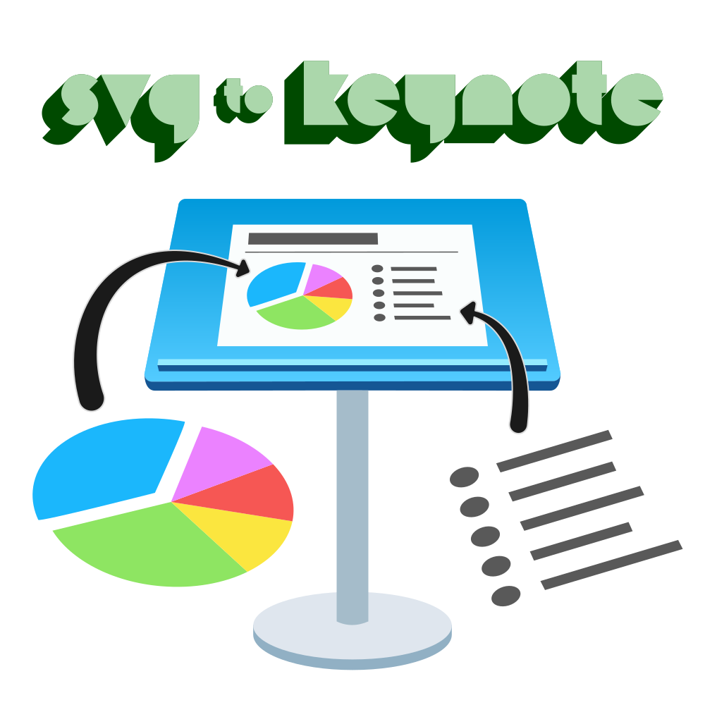

  

# SVG to Keynote

A [scalable vector graphic](https://en.wikipedia.org/wiki/Scalable_Vector_Graphics) (SVG) is an image format that enables infinite scaling without pixelation, unlike [raster graphic formats](https://en.wikipedia.org/wiki/Raster_graphics) like JPEG and PNG. Keynote doesn't support SVG files natively, though they have "shapes" that are vectors.

In 2005, David Astling published a [script](http://mcb.berkeley.edu/labs/zusman/dave/svg2key/) that could convert SVG files to Keynote shapes. This application doesn't run on newer versions of macOS (likely due to being 32-bit) and is no longer supported.

In 2016, Kyle Ledbetter posted [this article](https://kyleledbetter.medium.com/how-to-import-an-svg-into-powerpoint-or-keynote-8d3d70f347a7) outlining how to import SVG files into Keynote or Powerpoint by using [PPT files](https://www.lifewire.com/ppt-file-2622187) (Microsoft PowerPoint 97-2003) as a middleman. As noted by [others](https://medium.com/@chrishoman_15983/i-often-encounter-problems-with-opening-files-created-with-openoffice-and-i-found-libreoffice-a-5a72f652160f), I found Libre Office to be more stable with less quirks.

To make the process more viable for people who regularly need SVG files in Keynote, I made an [Alfred workflow](https://www.alfredapp.com/workflows/) to automate it. Then I was able to generalize it into a bash script.

If you would like native support for SVG files and other vector formats in Keynote, I recommend [sending Apple feedback](https://www.apple.com/feedback/keynote.html).
## Prerequisites

- [Keynote](https://apps.apple.com/us/app/keynote/id409183694)
  - Primarily tested with `10.3.9`
- [Libre Office](https://www.libreoffice.org/download/download/)
  - Primarily tested with `7.0.4.2` and `7.1.0`
  - Automated installation included 🙂

## Flavors

- [CLI](cli.md)
- [Alfred](alfred.md)

## Known Issues

| Issue                                                                                                              | Resolution                                                                                                                   |
| ------------------------------------------------------------------------------------------------------------------ | ---------------------------------------------------------------------------------------------------------------------------- |
| Fonts don't transfer well from SVG to PPT to Keynote                                                               | Convert text to curves/outlines/paths when exporting your SVG                                                                |
|Gradients displays fine in Libre Office but when opening the PPT file in Keynote it's gone|Recreate the gradient with Keynote's [native gradient fill](https://support.apple.com/en-us/HT210063) or save your content as a PDF file and drag & drop into Keynote to retain your original gradient|
| Background rectangle displays fine in Libre Office but when opening the PPT file in Keynote the rectangle is small | Resize rectangle or use Keynote's [native background color](https://support.apple.com/en-us/HT211077) on your slides |

## Credits

- Publisher of this process: Kyle Ledbetter ([Twitter](https://twitter.com/kyleledbetter), [Website](https://kyleledbetter.com/))
- PPT support: [The Document Foundation](https://www.documentfoundation.org/) and [Libre Office contributors](https://www.libreoffice.org/community/community-map/)
- Alfred development: [Running with Crayons Ltd](http://runningwithcrayons.net/), founded by [Andrew Pepperrell](https://twitter.com/preppeller) and [Vero Pepperrell](https://twitter.com/vero)
- Font in logo: [Morro by Great Scott](https://www.greatscott.se/fonts/morro)
