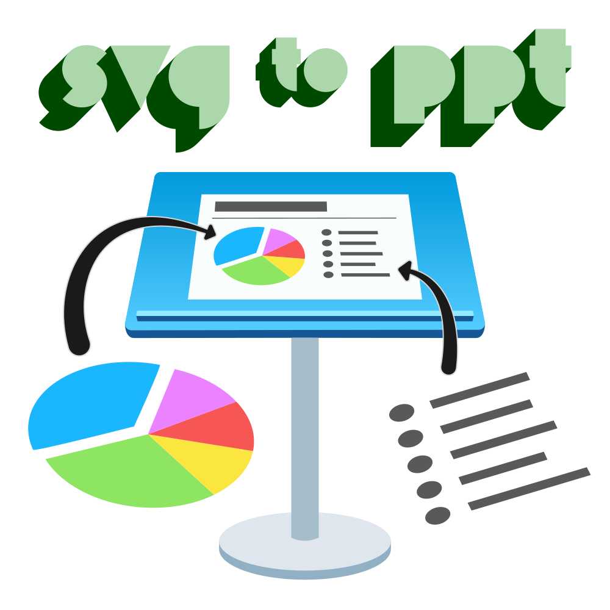

  

# Home

A [scalable vector graphic](https://en.wikipedia.org/wiki/Scalable_Vector_Graphics){:target="_blank"} (SVG) is an image format that enables infinite scaling without pixelation, unlike [raster graphic formats](https://en.wikipedia.org/wiki/Raster_graphics){:target="_blank"} like JPEG and PNG. Apple Keynote and Microsoft PowerPoint don't support SVG files natively, though they have "shapes" that are vectors.

In 2005, David Astling published a [script](http://mcb.berkeley.edu/labs/zusman/dave/svg2key/){target=_blank} that could convert SVG files to Keynote shapes. This application doesn't run on newer versions of macOS (likely due to being 32-bit) and is no longer supported.

In 2016, Kyle Ledbetter posted [this article](https://kyleledbetter.medium.com/how-to-import-an-svg-into-powerpoint-or-keynote-8d3d70f347a7){target=_blank} outlining how to import SVG files into Keynote or Powerpoint by using [PPT files](https://www.lifewire.com/ppt-file-2622187){target=_blank} (Microsoft PowerPoint 97-2003) as a middleman. As noted by [others](https://medium.com/@chrishoman_15983/i-often-encounter-problems-with-opening-files-created-with-openoffice-and-i-found-libreoffice-a-5a72f652160f){target=_blank}, I found Libre Office to be more stable with less quirks.

To make the process more viable for people like me who regularly want SVG files in Keynote, I made an [Alfred workflow](https://www.alfredapp.com/workflows/) to automate it. Then I was able to generalize it into a [Bash](https://www.gnu.org/software/bash/){target=_blank} script and [Libre Office macro](https://help.libreoffice.org/latest/en-US/text/shared/01/06130000.html){target=_blank}.

If you would like native support for SVG files and other vector formats in Keynote, I recommend [sending Apple feedback](https://www.apple.com/feedback/keynote.html){target=_blank}.

## Prerequisites

  
    <a target="_blank"href="https://www.apple.com/macos">
      macOS
      
    </a>
    Primarily tested with <code>10.15.7</code> (Catalina)
  
  
    <a target="_blank"href="https://www.libreoffice.org/download/download">
      Libre Office
      
    </a>
    Primarily tested with <code>7.0.4.2</code> and <code>7.1.0</code>
  

!!! note
    If you don't have Libre Office installed, SVG to PPT can install `7.1.0` for you! :slightly_smiling_face:

## Ways To Use

  
    <a target="_blank"href="cli">
      CLI
      
    </a>
  
  
    <a target="_blank"href="alfred">
      Alfred
      
    </a>
  

## Works With

  
    <a target="_blank"href="https://apps.apple.com/us/app/keynote/id409183694">
      Apple Keynote
    </a>
    
    Primarily tested with <code>10.3.9</code>
  
  
    <a target="_blank"href="https://www.microsoft.com/en-us/microsoft-365/powerpoint">
      Microsoft PowerPoint
    </a>
    
    Primarily tested with <code>16.46</code>
  
  
    <a target="_blank"href="https://www.openoffice.org">
      Apache OpenOffice
    </a>
    
    Primarily tested with <code>4.1.8</code>
  

## Known Issues

| Issue | Resolution |
|--|--|
| Fonts don't transfer well from SVG to PPT to Keynote | Convert text to curves/outlines/paths when exporting your SVG |
| Gradients displays fine in Libre Office but when opening the PPT file in Keynote it's gone | Recreate the gradient with Keynote's [native gradient fill](https://support.apple.com/en-us/HT210063){target=_blank} or save your content as a PDF file and drag & drop into Keynote to retain your original gradient |
| Background rectangle displays fine in Libre Office but when opening the PPT file in Keynote the rectangle is small | Resize rectangle or use Keynote's [native background color](https://support.apple.com/en-us/HT211077){target=_blank} on your slides |  |  |

## Credits

- Publisher of the conversion process: Kyle Ledbetter ([Twitter](https://twitter.com/kyleledbetter){target=_blank}, [Website](https://kyleledbetter.com/){target=_blank})
- Libre Office support: [The Document Foundation](https://www.documentfoundation.org/){target=_blank} and [Libre Office contributors](https://www.libreoffice.org/community/community-map/){target=_blank}
- Website theme: [Material for MkDocs](https://squidfunk.github.io/mkdocs-material/){target=_blank}
- Font in branding: [Morro by Great Scott](https://www.greatscott.se/fonts/morro){target=_blank}
- Alfred developers: [Running with Crayons Ltd](http://runningwithcrayons.net/){target=_blank}, founded by [Andrew Pepperrell](https://twitter.com/preppeller){target=_blank} and [Vero Pepperrell](https://twitter.com/vero){target=_blank}
